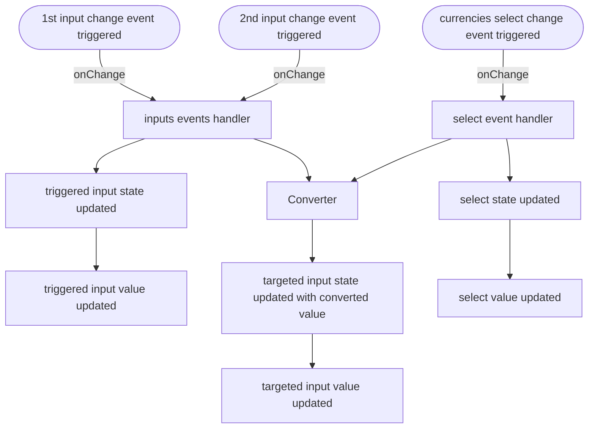

# Currencies converter

Please run `npm install` and `npm run start` to see the converter in action.

## <Form \/> flowchart

Handling the bidirectional conversion with `useEffect` would have generated undesired and low performant rerenderings.

I then decided to handle conversions manually in the inputs and select event handlers. 

Here's what happens within the `Form` Component.

## Personal notes and concerns

A mono-directional converter would have looked poor, so I made the conversion bidirectional and added a chart. 

I also created two themes that will be enabled based on the system preferences (dark/light mode)

---

Unfortunately `react queries` was not compatible with the latest `create react app` stable version, so I created a custom hook (`useRate`) to handle data fetch;

I then anyway downgraded `react script`, `react` and `react-dom` due to the current lack of compatibility from vendors.